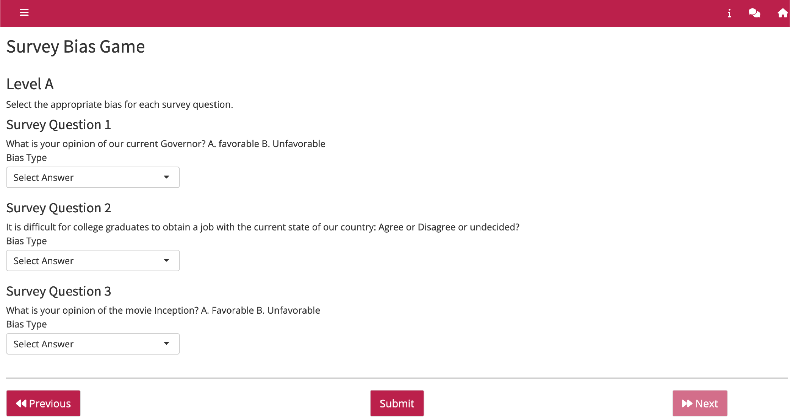

# Question Wording Bias

  

This app is focused on learning about common types of biased wording in survey samples (deliberate bias; filtering; anchoring; unintentional bias; unnecessary complexity; and asking the uninformed).
